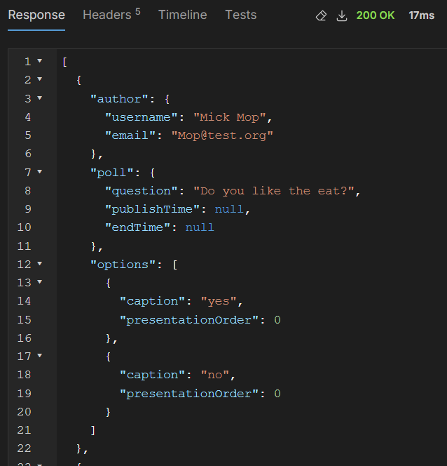

## Experiment 2 - Poll App

Note: I had a lot of compulsory assignments in other subjects this week. So i wasn't able to spend the time that i wanted on this assignment. Thus there are some holes. 

Tasks:
- 1 : Bruno
- 2 : Already done
### Task 3
I created a series of requests in bruno which i used to assess my code. 
Example of GET (http://localhost:8080/polls):

### Task 4
I created my handlers and accepted GET & POST reqests for creating polls & votes among other things.
I created a type called PollRequest for bundling the input data when creating the polls. Though i didn't imideately think off doing with the user as a URL parameter. Which would've been a better idea.

So you can send a POST request to (http://localhost:8080/polls) and send JSON in the form of a PollRequest and it will be correctly added. The same data will be generated and sent back when using the GET request at the same path.

Due to time constraints with the other work i had this week i did not manage to make the votes work correctly. Especially their relationship with the VoteOptions. 
As well i did not seem to find the presentationOrder variable to be an optimal way of managing the order of the options. 

And the deletion of polls is not fully implemented, especially culling the acociated votes. 

## Task 4
I wrote some short scripts in bruno to assess the correctness of my code. I assume this is what you wanted from this task

## Further tasks
As mentioned i was particularly strapped for time this week. So i did not tackle the further tasks. 

This might be a recurring pattern this year due to the ammount of work in these tasks and how much other weekly hand ins i have this semester. 

## Technical issues
In terms of technical issues, IntelliJ refused to use the WSL JDK and just froze anytime i tried to pick the correct one installed with SDKman. So i had to switch back to VS code. 

Other than that i did not experience too many technical issues. Other than WSL forgetting my Git private key. Which i had to manually assign again. 

